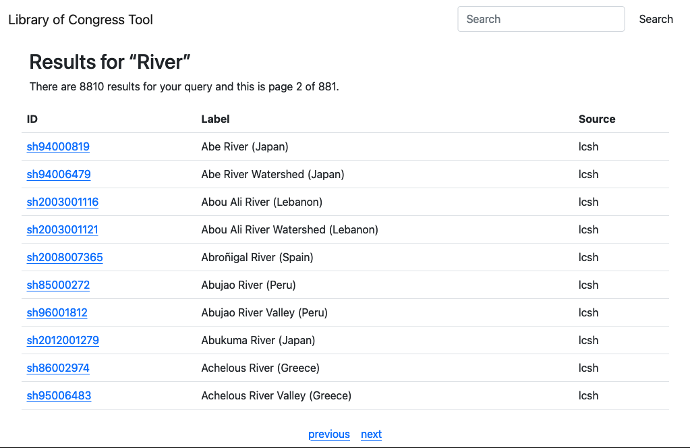

# go-libraryofcongress-database

Go package providing simple database and server interfaces for the CSV files produced by the [sfomuseum/go-libraryofcongress](https://github.com/sfomuseum/go-libraryofcongress) package.

## Important

This is work in progress and not documented properly yet. The code will continue to move around in the short-term. Everything you see here is still in the "proof-of-concept" phase. It should work but may still have bugs and probably lacks features.

## Motivation

The first goal is to have a simple, bare-bones HTTP server for querying data in the CSV files produced by the [sfomuseum/go-libraryofcongress](https://github.com/sfomuseum/go-libraryofcongress) package.

The second goal is to be able to build, compile and deploy the web application and all its data (as SQLite databases) as a self-contained container image to a low-cost service like AWS App Runner or AWS Lambda Function URLs.

A third goal is to have a generic database interface such that the same code can be used with a variety of databases. As written the `server` tool only has a single database "driver" for querying SQLite databases but there are tools for indexing data in both Elasticsearch, DynamoDB and SQLite databases.

## Data

A sample SQLite database for Library of Congress subject headings is currently included with this package in the [data folder](data). Some notes:

* This database is stored using `git-lfs`.
* This databases was created using the `to-sqlite` tool described below.
* It is not clear whether an equivalent (or combined) database for Library of Congress named authorities will ever be included because it is very large.
* Eventually bundled data may be removed entirely.
* As written the code only handles a subset of all the possible (CSV) columns produced by the `sfomuseum/go-libraryofcongress` tools. Specifically: `id` and `label`. A third `source` column is appended to the databases to distinguish between Library of Congress subject heading and name authority file records.

## Databases

### DynamoDB

* https://aws.amazon.com/dynamodb/

Under the hood the code is using the [gocloud.dev/docstore](https://gocloud.dev/howto/docstore/) abstraction library which supports DynamoDB and a number of other document store engines. Currently on DynamoDB `docstore` collections are supported by default. If you need to support other databases you will need to clone and update the code in this package to add the relevant `import` statement. For example if you wanted to update the [cmd/index](cmd/index/main.go) tool to add support for MongoDB then your code would look like this:

```
package main

import (
	_ "gocloud.dev/docstore/mongodocstore"
)

import (
	"context"
	"log"

	"github.com/sfomuseum/go-libraryofcongress-database/app/index"
	_ "github.com/sfomuseum/go-libraryofcongress-database/docstore"
)

func main() {

	ctx := context.Background()
	logger := log.Default()

	err := index.Run(ctx, logger)

	if err != nil {
		logger.Fatalf("Failed to run indexer, %v", err)
	}
}
```

### Bleve

* https://blevesearch.com/

### Elasticsearch

* https://www.elastic.co/elastic-stack/

### SQlite

* https://sqlite.org/

## Database URIs

### bleve

```
bleve://{PATH_TO_DATABASE}
```

For example:

```
bleve:///usr/local/data/loc.db
```

### dynamodb

```
awsdynamodb://libraryofcongress?partition_key=Id&region={REGION}&credentials={CREDENTIALS}
```

Where `{CREDENTIALS}` is a valid [aaronland/go-aws-session](https://github.com/aaronland/go-aws-session#credentials) credentials string.

Or, if you are connecting to a local instance of DynamoDB:

```
awsdynamodb://libraryofcongress?local=true&partition_key=Id
```

You can use the `cmd/create-dynamodb-tables` tool to create a new `libraryofcongress` table in your DynamoDB instance. For example:

```
$> go run -mod vendor cmd/create-dynamodb-tables/main.go \
	-refresh \
	-client-uri 'awsdynamodb://libraryofcongress?local=true&partition_key=Id'
```

You can also use this tool to create tables in an AWS-hosted DynamoDB instance however given the volume of LoC data published you many want to use the tools for importing data in to DynamoDB from an S3 bucket described below in the [index](#dynamodb-1) section. I estimated that using the `index` tool described below it would take 10+ days to import all 11.5M Library of Congress records. That number may vary depending on how you've configured your DynamoDB tables but by way of comparison importing the same number of records using the S3-import functionality took under an hour. You can do either but the import-from-S3 functionality will try to create the table from scratch and fail if it already exists.

### elasticsearch

```
elasticsearch://?endpoint={ELASTICSEARCH_INDEX}&index={ELASTICSEARCH_INDEX}
```

For example:

```
elasticsearch://?endpoint=http://localhost:9200&index=loc
```

### sqlite

```
sql://{ENGINE}?dsn={SQLITE_DSN}
```

For example:

```
sql://sqlite3?dsn=/usr/local/data/loc.db
```

## Tools

```
$> make cli
go build -mod vendor -ldflags="-s -w" --tags fts5 -o bin/server cmd/server/main.go
go build -mod vendor -ldflags="-s -w" --tags fts5 -o bin/query cmd/query/main.go
go build -mod vendor -ldflags="-s -w" --tags fts5 -o bin/index cmd/index/main.go
go build -mod vendor -ldflags="-s -w" -o bin/create-dynamodb-csv cmd/create-dynamodb-csv/main.go
```

### index

#### bleve

```
$> ./bin/index -database-uri bleve:///usr/local/data/libraryofcongress.db -lcsh-data /usr/local/data/lcsh.csv.bz2
processed 5692 records in 1m0.001390571s (started 2021-10-27 15:52:35.790947 -0700 PDT m=+0.015128394)
processed 11161 records in 2m0.001847245s (started 2021-10-27 15:52:35.790947 -0700 PDT m=+0.015128394)
processed 16179 records in 3m0.000195064s (started 2021-10-27 15:52:35.790947 -0700 PDT m=+0.015128394)
processed 20693 records in 4m0.003592035s (started 2021-10-27 15:52:35.790947 -0700 PDT m=+0.015128394)
...time passes

processed 438053 records in 2h3m0.000624126s (started 2021-10-27 15:52:35.790947 -0700 PDT m=+0.015128394)
processed 441373 records in 2h4m0.002261248s (started 2021-10-27 15:52:35.790947 -0700 PDT m=+0.015128394)
processed 444805 records in 2h5m0.002327734s (started 2021-10-27 15:52:35.790947 -0700 PDT m=+0.015128394)
2021/10/27 17:58:09 Finished indexing lcsh

$> du -h -d 1 /usr/local/data/libraryofcongress.db/
761M	libraryofcongress.db/
```

#### dynamodb

```
$> ./bin/index \
	-database-uri 'awsdynamodb://libraryofcongress?partition_key=Id&region={REGION}&credentials={CREDENTIALS}' \
	/usr/local/data/lcsh.csv.bz2
```

Alternately you can use the [import S3 data in to a DynamoDB table](https://aws.amazon.com/blogs/database/amazon-dynamodb-can-now-import-amazon-s3-data-into-a-new-table/) functionality. The first step is to create a single CSV file of both the LCNAF and LCSH data with an additional `Source` column for each row. The `create-dynamodb-csv` tool was written for this purpose:

```
$> ./bin/create-dynamodb-csv \
	-lcnaf-data /usr/local/data/lcnaf.csv.bz2 \
	-lcsh-data /usr/local/data/lcsh.csv.bz2 \
	> loc.csv
```

Next gzip the new CSV file and upload it to an S3 bucket. Eventually the `create-dynamodb-csv` tool will be updated to be able to do both of these things by default but today it can not.

```
$> gzip loc.csv
$> aws s3 cp loc.csv.gz s3://{YOUR_S3_BUCKET}
```

Finally [follow the instructions for importing your CSV data into DynamoDB](https://docs.aws.amazon.com/amazondynamodb/latest/developerguide/S3DataImport.HowItWorks.html). Two things to note:

1. The import process will take a while to complete.
2. It is important that you manually add a secondary index on the `Label` column (using the `Id` column as the sort key) in the custom stable settings of the import flow. If you don't add that index you will not be able to look up entries by their label name. If you don't add that index at import time the time to backfill an index added after the fact will be measured in days (and you won't be able to delete the errant DynamoDB table until after the backfill is complete).

#### elasticsearch

_TBW_

#### sqlite

```
$> time ./bin/index -database-uri 'sql://sqlite3?dsn=test.db' -lcsh-data ~/Desktop/lcsh.csv.bz2
33.169u 15.511s 0:36.01 135.1%	0+0k 0+0io 0pf+0w

$> du -h test.db 
 46M	test.db
```

### server

The `server` tool is a simple web interface providing humans and robots, both, the ability to query a database.

```
$> ./bin/server -h
Usage of ./bin/server:
  -database-uri string
    	A valid sfomuseum/go-libraryofcongress-database URI. (default "sql://sqlite3?dsn=data/lcsh.db")
  -per-page int
    	The number of results to return per page (default 20)
  -server-uri string
    	A valid aaronland/go-http-server URI. (default "http://localhost:8080")
```

To start the server you might do something like this:

```
$> ./bin/server -database-uri 'sql://sqlite3?dsn=data/lcsh.db' -per-page 10
2021/10/18 13:11:24 Listening on http://localhost:8080
```

And then if you opened `http://localhost:8080/?q=River&page=2` in a web browser you'd see this:



There is also an API endpoint for querying the data as JSON:

```
$> curl -s 'http://localhost:8080/api/query?q=SQL' | jq
{
  "results": [
    {
      "id": "sh96008008",
      "label": "PL/SQL (Computer program language)",
      "source": "lcsh"
    },
    {
      "id": "sh86006628",
      "label": "SQL (Computer program language)",
      "source": "lcsh"
    },
    {
      "id": "sh90004874",
      "label": "SQL*PLUS (Computer program language)",
      "source": "lcsh"
    },
    {
      "id": "sh87001812",
      "label": "SQL/ORACLE (Computer program language)",
      "source": "lcsh"
    }
  ],
  "pagination": {
    "total": 4,
    "per_page": 10,
    "page": 1,
    "pages": 1,
    "next_page": 0,
    "previous_page": 0,
    "pages_range": []
  }
}
```

#### Notes

* The `server` tool only supports SQLite databases and Bleve indexes as of this writing. See below for details on tools to produce these data sources.
* The `server` tool does not yet have the ability to define custom prefixes for URLs. For the time being it is assumed that everything is served from a root `/` URL.

### query

The `query` tool is a command-line application to perform fulltext queries against a database generated using data produced by the tools in `sfomuseum/go-libraryofcongress` package.

#### bleve

```
$> ./bin/query \
	-database-uri bleve:///usr/local/data/libraryofcongress.db \
	Montreal
	
lcsh:sh85087079 Montreal River (Ont.)
lcsh:sh2010014761 Alfa Romeo Montreal automobile
lcsh:sh2017003022 Montreal Massacre, Montréal, Québec, 1989
```

#### dynamodb

```
$> ./bin/query \
	-cursor-pagination \
	-database-uri 'awsdynamodb://libraryofcongress?partition_key=Id&region={REGION}&credentials={CREDENTIALS}' \
	sh2011000946
	
lcsh:sh2011000946 Airport control towers--Washington (State)
```

#### sqlite

```
$> ./bin/query \
	-database-uri 'sql://sqlite3?dsn=test.db' \
	Montreal
	
lcsh:sh2010014761 Alfa Romeo Montreal automobile
lcsh:sh94006536 Boulevard Saint-Laurent (Montréal, Québec)
lcsh:sh2009118684 Central business districts--Québec (Province)--Montréal--Maps
lcsh:sh2008002760 Fur Trade at Lachine National Historic Site (Montréal, Québec)
lcsh:sh85073824 Lachine Canal (Montréal, Québec)
lcsh:sh2008003685 Lachine Canal National Historic Site (Montréal, Québec)
lcsh:sh2008002035 Louis-Joseph Papineau National Historic Site (Montréal, Québec)
lcsh:sh86005383 Maison Saint-Gabriel (Montréal, Québec)
lcsh:sh2008107459 Marriage records--Québec (Province)--Montréal
lcsh:sh2017003022 Montreal Massacre, Montréal, Québec, 1989
lcsh:sh85087079 Montreal River (Ont.)
lcsh:sh2008115936 Montréal (Québec)--Biography
lcsh:sh2008115937 Montréal (Québec)--Fiction
lcsh:sh2008107460 Montréal (Québec)--Genealogy
lcsh:sh2008115938 Montréal (Québec)--Guidebooks
lcsh:sh95002319 Montréal (Québec)--History
lcsh:sh95002320 Montréal (Québec)--History--Siege, 1775
lcsh:sh85087078 Montréal Island (Québec : Island)
lcsh:sh2007000305 Parc Belmont (Montréal, Québec)
lcsh:sh2002003622 Parc Jarry (Montréal, Québec)
lcsh:sh88006626 Parc Sohmer (Montréal, Québec)
lcsh:sh2002003824 Parc du Mont-Royal (Montréal, Québec)
lcsh:sh2005005587 Place Ville Marie (Montréal, Québec)
lcsh:sh93002004 Place d'Armes (Montréal, Québec)
lcsh:sh93002901 Pointe-à-Callière Site (Montréal, Québec)
lcsh:sh94001599 Pont Victoria (Montréal, Québec)
lcsh:sh2001005269 Poudrière (Montréal, Québec)
lcsh:sh2015001674 Rue Sainte-Catherine (Montréal, Québec)
lcsh:sh2005005292 Rue Sainte-Hélène (Montréal, Québec)
lcsh:sh2007003084 Sherbrooke Street (Montréal, Québec)
lcsh:sh2008002166 Sir George-Étienne Cartier National Historic Site (Montréal, Québec)
lcsh:sh2002005306 Stock Exchange Tower (Montréal, Québec)
```

## Docker

Yes, there is a Dockerfile for the `server` tool. The simplest way to get started is to run the `docker` target in this package's Makefile:

```
$> make docker
```

And then to start the server:

```
$> docker run -it -p 8080:8080 \
	-e LIBRARYOFCONGRESS_DATABASE_URI='sql://sqlite3?dsn=/usr/local/data/lcsh.db' \
	-e LIBRARYOFCONGRESS_SERVER_URI='http://0.0.0.0:8080' \
	libraryofcongress-server
```

And then visit `http://localhost:8080` in a web browser.

### Notes

* As written the `Dockerfile` will copy all files ending in `.db` in the `data` folder in to the container's `/usr/local/data` folder.

## See also

* https://github.com/sfomuseum/go-libraryofcongress